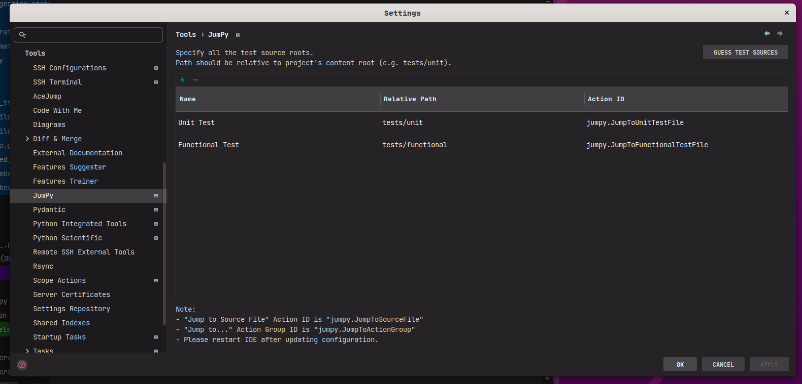
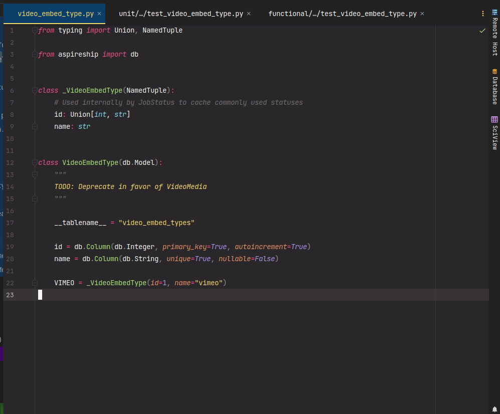

# intelli-plugin-jumPy


[](https://plugins.jetbrains.com/plugin/PLUGIN_ID)
[](https://plugins.jetbrains.com/plugin/PLUGIN_ID)


<!-- Plugin description -->
Easily navigate between source and test files for python projects using package directory structure rules.

#### Requirements for Plugin to Work Properly

- Source and test directory reside under the same project content root.
- The package tree structure for each test directory and the package directory mirror one another.

Example:

```text
my_package_1/
  __init__.py
  module_1.py
my_package_2/

tests/
  __init__.py
  my_package_1/
    __init__.py
    test_module_1.py
  my_package_2/
```

Or

```text
my_package_1/

tests/
  __init__.py
  unit/
    __init__.py
    my_package_1/
      __init__.py
      test_module_1.py
  functional/
    __init__.py
    my_package_1/
```

#### Motivation

Pycharm's default _Go To Test_ functionality is not too practical from personal experience using **pytest**.
Namely, it assumes a 1-1 source class to TestCase class organization that doesn't conform naturally with python projects
organized around python modules. Tests aren't always organized around TestCase classes, and Pycharm's pattern matching
policy between source and TestCase classes could also get noisy for large projects.

This plugin provides a mean to navigate between source modules and test modules via project directory structure pattern
rules.

## Setup

Navigate to <kbd>Settings/Preferences</kbd>  > <kbd>Tools</kbd>  > <kbd>JumPy</kbd>. The easiest way to setup would be
to click "Guess Test Source Root" button and adjust the test roots as needed.

After updating the configuration, please restart IDE for the actions to register properly again.



## Usage



IDE shortcuts and IdeaVim Shortcuts may be assigned to both the group and individual actions.

<!-- Plugin description end -->

## Installation

- Using IDE built-in plugin system:

  <kbd>Settings/Preferences</kbd> > <kbd>Plugins</kbd> > <kbd>Marketplace</kbd> > <kbd>Search for "
  intelli-plugin-jumPy"</kbd> >
  <kbd>Install Plugin</kbd>

- Manually:

  Download the [latest release](https://github.com/mukatalab/intelli-plugin-jumPy/releases/latest) and install it
  manually using
  <kbd>Settings/Preferences</kbd> > <kbd>Plugins</kbd> > <kbd>⚙️</kbd> > <kbd>Install plugin from disk...</kbd>

---
Plugin based on the [IntelliJ Platform Plugin Template][template].

[template]: https://github.com/JetBrains/intellij-platform-plugin-template
